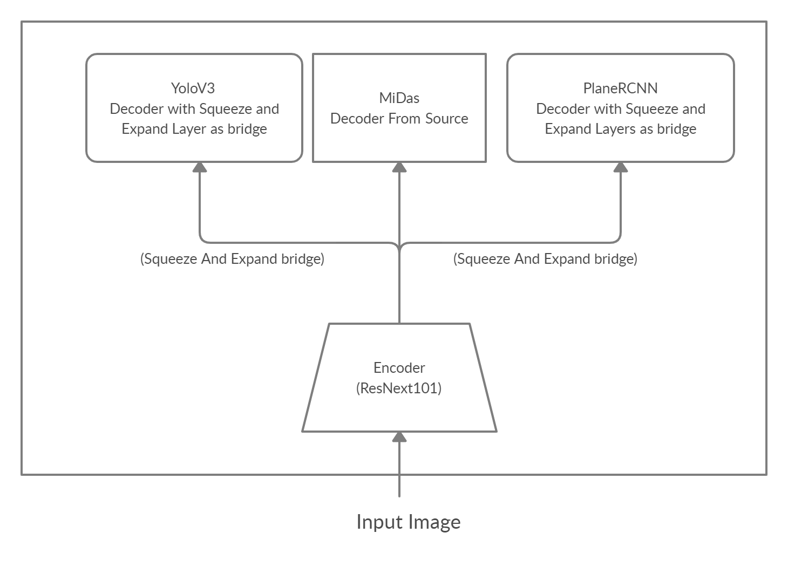

<h1 align="center"> AgentVision2.0</h1>

<div align="center">

</div>

AgentVision is a three-headed bot. Each head has it's own objective.

Head 1. Prediction of given classes from the input image <br/>
Head 2. Prediction of Depth Map<br/>
Head 3. Prediction of planar surfaces in the region<br/>

#### Directory structure
```
├───logs
├───resources
└───src
    ├───agentvision
    │   ├───midas
    │   │   ├───midas
    │   │   └───tf
    │   │       ├───input
    │   │       └───output
    │   ├───planercnn
    │   │   ├───anchors
    │   │   ├───datasets
    │   │   ├───data_prep
    │   │   │   └───Renderer
    │   │   ├───example_images
    │   │   └───models
    │   └───yolov3
    │       ├───.github
    │       │   ├───ISSUE_TEMPLATE
    │       │   └───workflows
    │       ├───cfg
    │       ├───data
    │       ├───utils
    │       └───weights
    ├───config
    ├───docs
    │   └───images
    ├───input
    ├───notebook
    └───output
```

**Description:** agentvision directory contains three models which corresponds to three heads.
1. yolov3: for Object Detection
2. midas: for Depth maps
3. planercnn: for Planar regions

These three models were copied from the source and connected as one Encoder-Decoder model. 

<h4 align="center"> Encoder - Decoder Architecture </h4>

<div align="center">

</div>

The encoder was taken from Midas which is a ResNext101, since the other two also kind of uses Resnet as the encoder.
The three models taken from the source are the decoders. To connect the encoder of Midas with the other models, we need a bridge.
A squeeze and expand layer is introduced between Midas encoder and Yolov3 decoder, whereas 4 squeeze and expand layers were used as a bridge between midas encoder and the planercnn. <br/>

This can be seen in the model.py from agentvision.


<h4 align="center"> The Journey and Take Away </h4>

I would describe the journey in five steps
1. Strategies based on the Dataset
2. Dataset preparation
3. Putting the models together
4. Bridging the models
5. Training and Inference

Learnings on the dataset
1. If the input images are between 2000 and 5000 per class, then freeze the model and fine tune the last few layers,
example to freeze the midas model:
<br/>
`for param in self.midas_net.parameters():<br/>
 param.requires_grad = False
                ` 
> If the input images are between 5000 and 10000 per class, then fine tuning will be good.
> If the input images are greater than 10000 per class, then the entire model can be trained

2.. Hence, make sure atleast the input dataset has 2000 to 5000 per class, if not generate data by running the models individually or collect more data
- Given dataset satisfied the first condition. If time permits, then will collect more training data

3.. Already pretrained models of Yolov3, Midas and Planercnn was available. Now, based on the architecture mentioned above, integrate all the three into one encoder decoder.
Copy pasted the code from the source into one repo.

4.. To connect the three decoders to one encoder, we need to have some bridge inbetween for the models to capture the features extracted by the encoder. Squeeze and Expand Layer is chosen as the bridge
That is, 512x512 was squeezed to 256 and then expanded to 512, can be seen in models.py for yolov3.
For planercnn 256 was squeezed to 128 and expanded to 256 and similarly with 512, 1024 and 2048 as 4 squeeze and expand layers.

5.. Once, the bridge was introduced, training was planned in the below fashion

a. Train on smaller images, this will be faster (64 x 64), Because while doing the initial run, train faster on smaller images and then fix the architecture. Only then train on larger images

b. With smaller images, the batch sizes can be increased and trained even faster

c. First train, only one model by making the scaling factor of Planercnn and midas model as zero, yolov3 will be trained

d. similarly, other two models can be trained and then the architecture can be fixed

- At this step, the integration was not successful, there were many bugs and the model failed to run. Trying to fix the architecture and run again.


  


