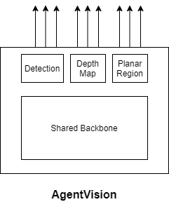

<h1 align="center"> AgentVision2.0</h1>

AgentVision is a three-headed bot. Each head has it's own objective.

Head 1. Prediction of given classes from the input image  
Head 2. Prediction of Depth Map 
Head 3. Prediction of planar surfaces in the region 
